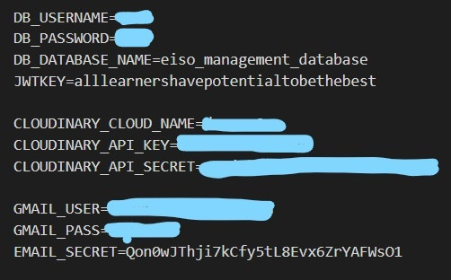

# Uji-Matcha-Store

# Installation:
To run this project, make sure to download and run the SQL, followed by cloning this repository. Be sure to input your information in a .ENV file as well as the database.

Create a .ENV file under the <code>backend</code> folder details as follows:<br>
Any details covered are of your own values




### Cloudinary Setup:
File name can be any to your liking. 
Under the upload preset:
1. Disable Unsigned Uploading
2. Create a new upload preset
3. Upload preset name MUST be `upload_to_ADES`
4. Remember to link your File to the upload preset
5. Be sure to key in your keys/secrets in the .ENV file 
<br><br>
### Starting the Servers :

1. To start backend server:
```   
$ cd backend
$ npm i
$ npm start
```
2. to start frontend server:
```
$ cd frontend
$ npm i
$ npm start
```
